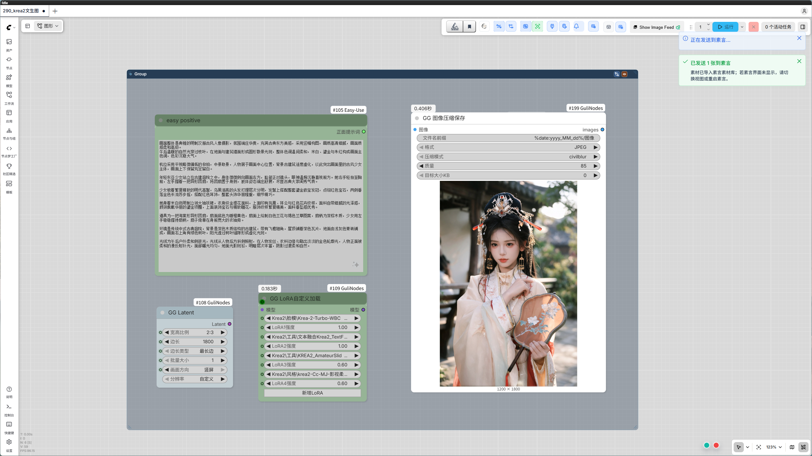
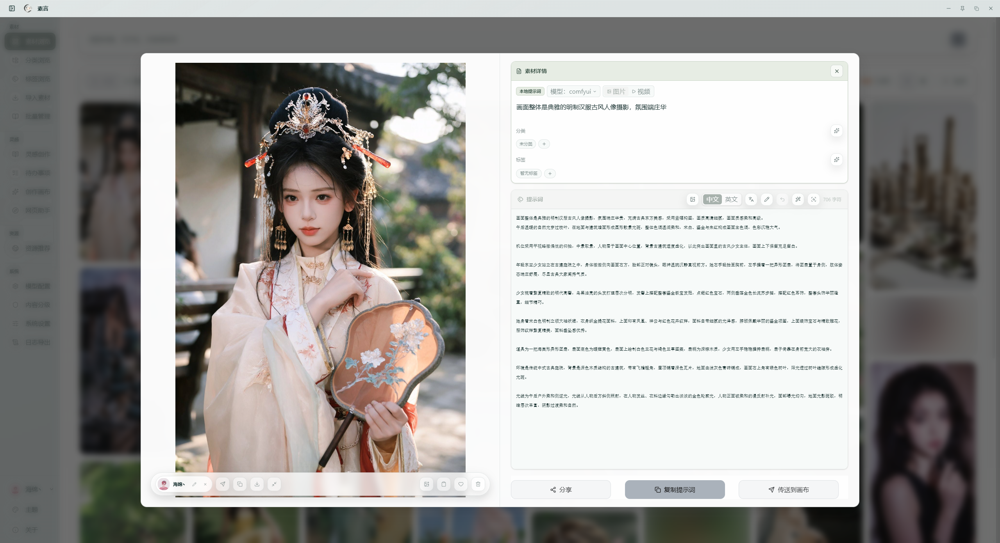
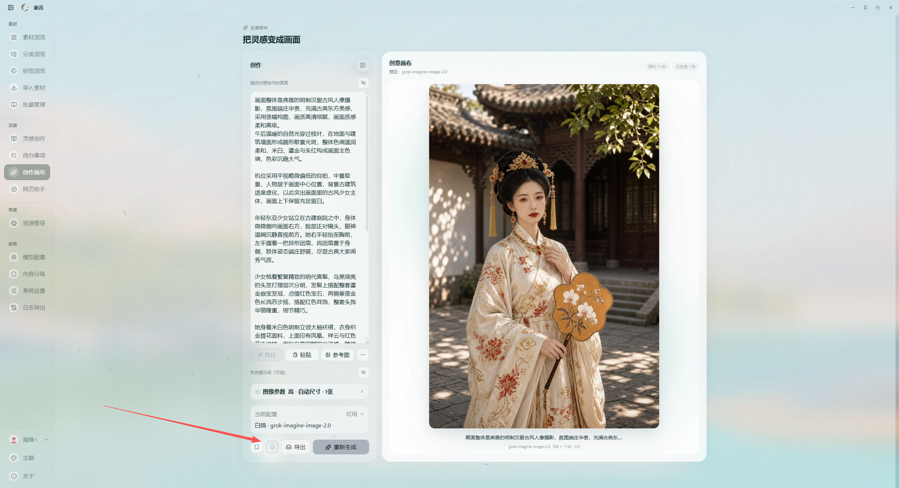
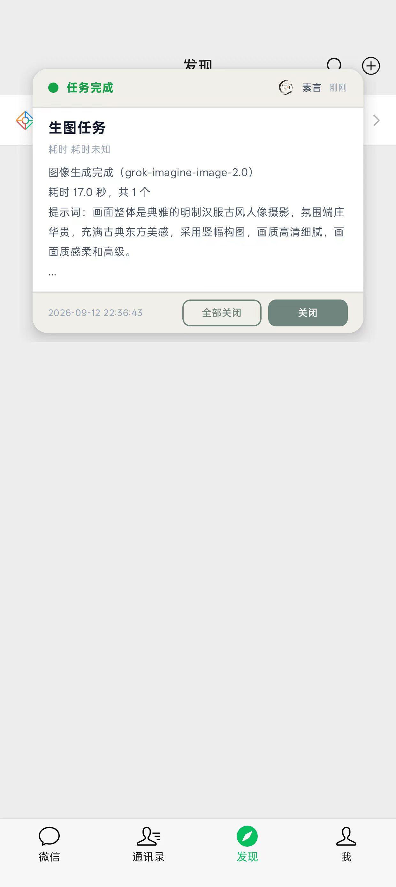

<div align="center">

# SuYan 素言

[简体中文](./README.md) | **English**

**A local-first AI prompt, image, and creative-material manager**

Keep artwork, videos, prompts, categories, tags, and creative plans together so they are easy to find, reuse, organize, and share.

[GitHub](https://github.com/guliacer/SuYan) · [Features](#features) · [Quick start](#quick-start) · [Changelog](#changelog) · [FAQ](#faq)

**Free forever · MIT licensed · No paid activation**

<br />


</div>

> SuYan stores materials, prompts, settings, and logs locally by default. Sign-in is used for identity, authorship, and account-verified imports; it is not cloud sync. Local work created before sign-in is not automatically uploaded or claimed.

## Features

### Local library

- Browse images, videos, and grouped artwork in a responsive masonry or grid / list view.
- Search titles, filenames, prompts, categories, and tags; filter by favorites and sort by time, size, or random order.
- Edit positive / negative prompts, copy text or images, favorite items, manage categories and tags, record model information, and keep multiple artwork files per prompt group.
- Keep the original artwork first in a group; later imports are appended by import time.
- Recover gracefully when thumbnails are missing, generating, or failed by waiting or falling back to the original media.


### Import, batch processing, and export

- Import local images / videos, paste clipboard images, read Word documents, import share ZIPs, or parse supported web share links.
- Mount existing media folders as external indexes without copying or deleting the original files. Watch, re-locate, rescan, and clean missing indexes when needed.
- Batch-select, copy, delete, deduplicate, compress images, and compress videos.
- Export runs with progress in the background so the main UI remains usable; import and export dialogs remember the last folder.
- Prompt share packages can include the selected works' related category and tag knowledge, groups, and covers.
- Export filenames include the app name, version, content type, and timestamp.


### AI assistant

- Configure providers, models, and rules independently for category recognition, tag recognition, prompt optimization, translation, image reverse prompting, and generation.
- Analyze categories and tags from either the prompt or artwork. Model selectors use the provider's actual model IDs and remember each action's preferred model and analysis source.
- Organize prompts by subject, scene, composition, lighting, and style. Local rules constrain AI results so visual attributes are not treated as categories and unsupported tags are not invented.
- Use **Organize** beside AI tags to merge synonyms, group unorganized tags, classify entities, and correct wrong groups with preview, confirmation, and undo.
- Export AI settings normally, with a password, or with account verification. Account-verified backups can only be imported after the same account is verified.


> AI endpoints and API keys are user-provided. Browsing, editing, local lexicons, import, and export remain available without an AI configuration.

### Creative canvas

- Edit prompts and call configured image / video models inside the app.
- Fit generated artwork to the available canvas area; copy, favorite, export, regenerate, or add results to the local library.
- Collapse and restore the parameter panel. Canvas backgrounds can follow the theme, use the classic white style, or use a custom color or image.
- Generation mode adds scanning, energy-field, particle, and completion effects while the idle canvas stays restrained.
- Use reference images, clipboard paste, quick model switching, and structured generation errors.


### Ideas and tasks

- Save text-only prompts, workflows, configuration notes, and GitHub project notes without needing an artwork file.
- Rich text, variables, categories, tags, favorites, drag sorting, copy, import, and export are supported.
- Tasks support projects, subtasks, priority, progress, tags, archives, and quick creation.
- The monthly calendar supports single-day-off, alternate-week, and two-day-off schedules. Workdays, rest days, holidays, and make-up workdays can be queried and adjusted manually.
- Export all tasks or only selected tasks.


### Accounts and authorship

- Uses real OIDC Authorization Code + PKCE authorization through [Guli Identity](https://auth.guliacer.dpdns.org).
- Email registration / sign-in, Google, GitHub, Linux.do, and device-code flows complete in the system default browser. SuYan never receives provider passwords or a `client_secret`.
- Link multiple sign-in methods. After authorization, confirm whether to use the current or new account's name and avatar, or enter custom profile details.
- New generated or imported works can record the signed-in account. Older local works are not automatically synced; detail and batch views provide explicit sync actions with confirmation before replacing existing authorship.
- Local linked works follow a new avatar after the account profile changes; share packages can retain author information.
- Tokens are protected by the operating system secure store in the Electron main process.

### ComfyUI, web assistant, and resources

- A local receiver listens on `127.0.0.1:9477` and accepts images, prompts, negative prompts, titles, and generation methods from ComfyUI.
- ComfyUI PNG prompt / workflow metadata is parsed automatically and uses the same local import path.

#### ComfyUI quick save

Install and enable [ComfyUI-GuliNodes](https://github.com/guliacer/ComfyUI-GuliNodes). When an image finishes generating in ComfyUI, click the SuYan icon above the canvas to send the image and its associated prompt to SuYan for quick saving.

Start SuYan before the first use and keep it running. After a successful send, the image is added to the SuYan library together with its prompt, negative prompt, title, and generation method; prompt / workflow metadata embedded in the ComfyUI PNG is parsed automatically as well.

If sending fails, make sure SuYan is running, ComfyUI can access `127.0.0.1:9477`, and ComfyUI-GuliNodes is installed and enabled.





#### Generation completion notifications

When you need to step away from your computer, use [TapRelay](https://github.com/guliacer/TapRelay/releases) to send generation-complete notifications to your phone. Download TapRelay, follow its setup instructions to connect your devices, then return to SuYan's creative canvas and turn on the notification button below the canvas before starting generation.

When the generation task finishes, SuYan sends a completion notification through TapRelay to the connected phone. The notification includes the completion status and basic task details. Keep TapRelay available and make sure the connection between your phone and computer is working before use.





- The web assistant provides a controlled web workspace and site directory for common creative websites.
- Resource recommendations focus on maintained model, tool, prompt, and creative-resource links; expired entries are removed or updated.

### Content rating and optional components

- Local NSFW rating, default blur, temporary reveal in detail, and batch re-rating are supported.
- FFmpeg and the local NSFW runtime are optional components. Fixed download locations, signed manifests, and file hashes are verified before installation.
- The app does not package personal media, accounts, settings, or logs.

### Appearance, language, and guidance

- Translucent glass title bar and sidebar, with independent accent, secondary, tertiary, navigation, background, and workspace colors.
- Canvas backgrounds, sidebar entries, layout, and always-on-top state persist locally.
- Simplified Chinese is the default UI language; switch to English in System Settings. User prompts, tags, categories, and material content are not automatically translated.
- First-use guidance covers each page's real controls, including import methods, prompt cards, canvas parameters, AI connections, system settings, and window controls.
- Check official GitHub releases and choose update now, remind later, ignore this version, or never remind.


## Quick start

### Use a release build

Download the available installer or portable build from [GitHub Releases](https://github.com/guliacer/SuYan/releases). The current release is `v0.3.8`; the latest version is always shown on the Releases page.

`v0.3.8` provides four Windows packages: portable or installer, with either the standard runtime or the complete local optional components. Choose the edition that matches your workflow and offline media / content-rating needs, then verify the download with the included `SHA256SUMS.txt`.

If GitHub downloads are slow, mirror downloads are also available:

- [Quark Drive](https://pan.quark.cn/s/5d22e38ac71a)
- [Baidu Netdisk](https://pan.baidu.com/s/1clGqo2sebMwzt3WhwESWQA), extraction code: `bf8y`

Choose the installer or portable file matching the required edition, then use the included `SHA256SUMS.txt` to verify the download.

Run the installer and choose a directory, or extract the portable build to a writable folder and run `素言.exe`. The first launch creates `data\` and `logs\` beside the app.

### Develop locally

Requirements: Windows 10 / 11, Node.js, and pnpm 11.9.0.

```powershell
pnpm install
pnpm dev
```

Useful checks:

```powershell
pnpm typecheck
pnpm test
pnpm check:secrets
pnpm check:empty-shell
pnpm check:release-notes
```

Build the development Windows portable directory:

```powershell
pnpm package:win
```

Build installer and portable release artifacts:

```powershell
pnpm package:win:release
```

Release artifacts must not include `data\`, `logs\`, API keys, account credentials, personal media, or private configuration. See [docs/Windows四版本打包.md](./docs/Windows四版本打包.md) for optional-component editions.

Before pushing or creating a GitHub Release, `pnpm check:release-notes` must pass. Once the Release exists, also run `pnpm check:release-notes:remote` to confirm that the Chinese / English description matches the remote body.

## Data and privacy

- Managed materials live under `data\library\`; logs live under `logs\`. External materials keep only relative indexes under registered roots.
- API keys and account tokens are not written to the README, installer, or logs. Logs are sanitized and do not contain full prompts, image bytes, or credentials.
- The library, ideas, tasks, lexicons, and settings are local by default. Sign-in is not cloud sync and does not upload older local work.
- Before upgrading or uninstalling, exit the app and copy the entire `data\` folder outside the app directory. A share ZIP contains selected works, not a complete backup.

## Changelog

### v0.3.8 (current release)

Compared with `v0.2.10`, this release adds accounts, idea management, web assistance, and local content rating while improving the creation, organization, and backup workflows.

**New features**

- **Accounts and ownership**: Added real OIDC + PKCE browser authorization for email, Google, GitHub, Linux.do, and device-code sign-in. Multiple login methods can be linked, with confirmation for display name, avatar, and work ownership.
- **Idea library and tasks**: Added storage and organization for plain-text ideas, prompts, workflows, and configuration notes, with categories, tags, variables, favorites, drag ordering, import / export, and calendar planning.
- **Web assistant**: Open Doubao and other creative sites inside the app to reduce context switching, with a controlled web workspace and site directory.
- **Themes and sidebar management**: Added coordinated theme colors, navigation and canvas appearance settings, and controls to show, hide, and organize sidebar entries.
- **Local content rating**: Added an optional local NSFW model component for sensitive-content detection, default blur, temporary reveal in detail, and batch re-rating. Other configured detection modes remain available when the component is not installed.
- **ComfyUI quick save**: With ComfyUI-GuliNodes, send a completed image and its prompt to SuYan for archiving with one click.
- **TapRelay completion notifications**: Send generation success or failure status to a phone through TapRelay when you need to leave the computer unattended.
- **Page-specific guidance**: First entry to each feature page provides skippable, repeatable help focused on the real controls, including imports, prompt cards, the canvas, AI connections, system settings, and window controls.

**Improvements**

- Improved most page layouts, responsive behavior, unified dialogs, and navigation visuals so controls remain usable at different resolutions.
- Improved the creative canvas with adaptive presentation, theme-aware backgrounds, collapsible parameters, and generation effects.
- Improved AI analysis and management, including prompt optimization, translation, reverse prompting, category and tag detection, and constrained consolidation.
- Improved AI / API settings with multiple providers, endpoint model discovery, per-action model and analysis-source preferences, and settings backup import / export.
- Refreshed resource recommendations with image-generation services and model entry points that offer free trials or free quotas, while retaining relevant usage conditions.
- Improved large-library backups with volume splitting, multi-volume import, bundled category and tag libraries, background progress, and remembered folders.
- Also improved thumbnail fallback, original-image ordering, image copying, sanitized structured logs, failure diagnostics, and four Windows release packages.

**This release also fixes**

- Manual tags entered in the prompt detail view are preserved instead of being removed by the stricter AI tag filter.
- Adding, removing, or renaming a manual tag now uses the same normalized save path and keeps duplicate, empty, and over-limit values under control.
- Prompt editing and prompt creation no longer wrap the rich-text editor and its toolbar in a label element, so arrow keys stay in the editor instead of jumping to the first toolbar button.
- Added regression coverage for manual tag persistence and rich-text editor focus structure.

### v0.2.10

- Added mounted material folders, built-in canvas generation, configurable analysis sources, prompt-site adapters, and resource recommendations.
- Improved sharing, data placement, menus, drag grouping, native dialogs, category / tag analysis, AI error feedback, and layout.

## FAQ

<details>
<summary><b>Is SuYan paid?</b></summary>

No. It is MIT licensed and free to use. Download from [GitHub Releases](https://github.com/guliacer/SuYan); report paid installers or activation services via [Issues](https://github.com/guliacer/SuYan/issues).

</details>

<details>
<summary><b>Can I use it without AI?</b></summary>

Yes. Browsing, search, editing, copying, favorites, import / export, lexicons, and tasks work locally. AI analysis, online generation, web parsing, and some web features need network access or configured services.

</details>

<details>
<summary><b>Does sign-in automatically sync older work?</b></summary>

No. Older local works stay local. New work can be associated after explicit confirmation, and replacing existing authorship requires another confirmation.

</details>

<details>
<summary><b>Why does third-party sign-in open the browser?</b></summary>

That is the real OIDC authorization flow. SuYan starts a PKCE request and does not collect Google, GitHub, or Linux.do passwords. The browser returns to the app through `suyan://oauth/callback`.

</details>

<details>
<summary><b>How do I back up before an upgrade?</b></summary>

Exit the app and copy the entire `data\` folder outside the app directory. A share package is for exchanging selected works and is not a full backup.

</details>

<details>
<summary><b>How should I report a problem?</b></summary>

Use **Export Logs** in the app, then open a [GitHub Issue](https://github.com/guliacer/SuYan/issues) with the reproduction steps, expected result, actual result, and app version. Review exported attachments before sharing them.

</details>

## Contributing and license

Bug reports, feature ideas, and UX feedback are welcome. Include the version, operating system, reproduction steps, expected result, and actual result when possible.

SuYan is released under the [MIT License](./LICENSE). It uses open-source projects including Electron, React, Vite, TypeScript, Zustand, Lucide, JSZip, Sharp, Chokidar, openid-client, Vitest, and electron-builder. Exact versions and licenses are tracked in [package.json](./package.json) and [pnpm-lock.yaml](./pnpm-lock.yaml).

<div align="center">

**Made with ❤️ by SuYan 素言**

</div>
