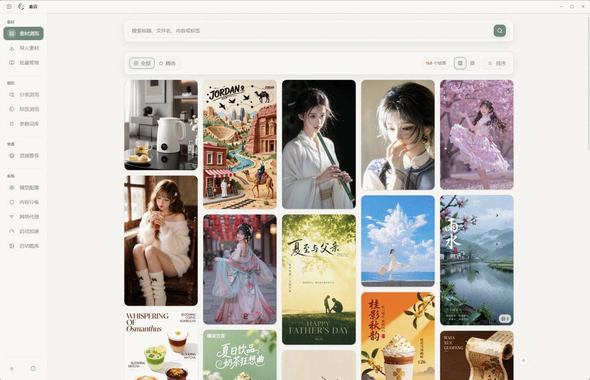
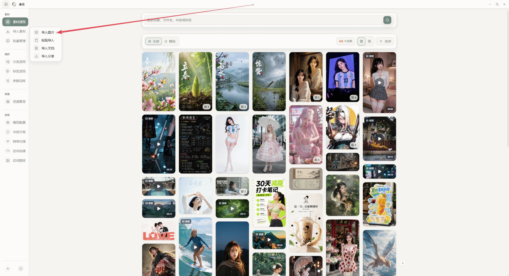
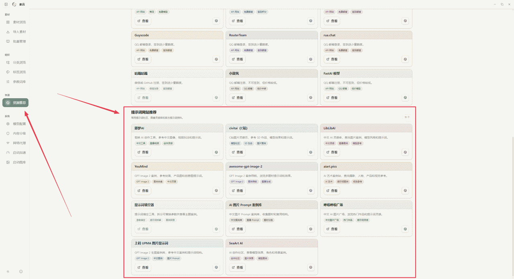
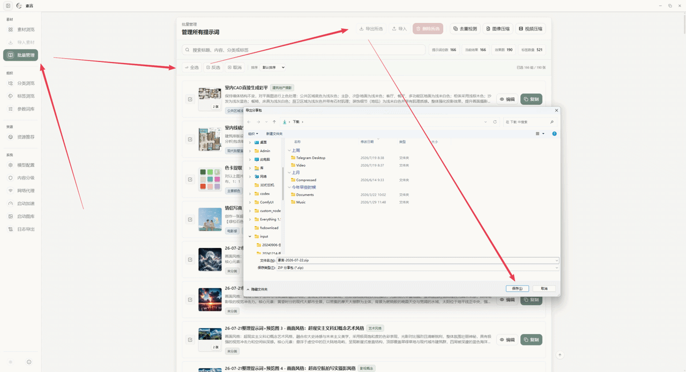
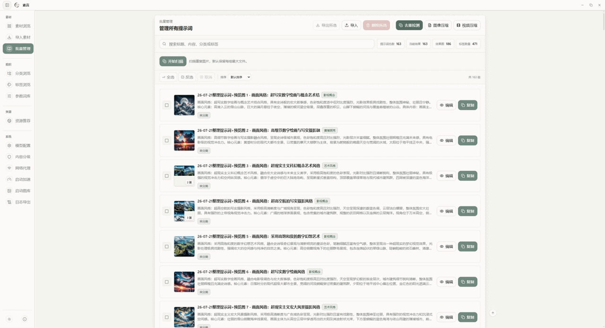
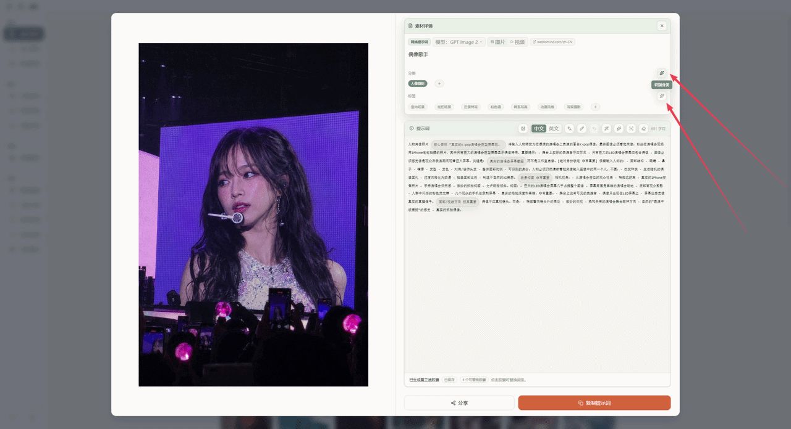
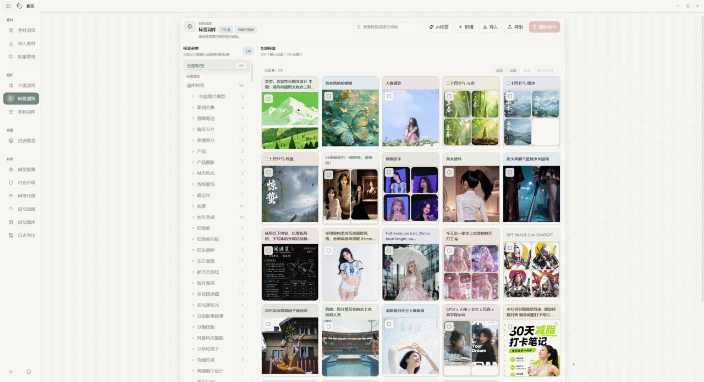
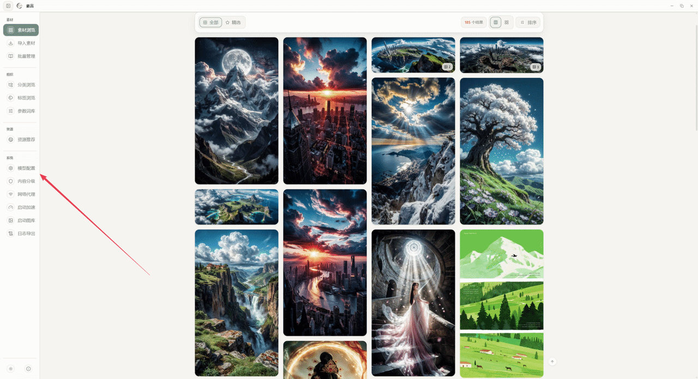
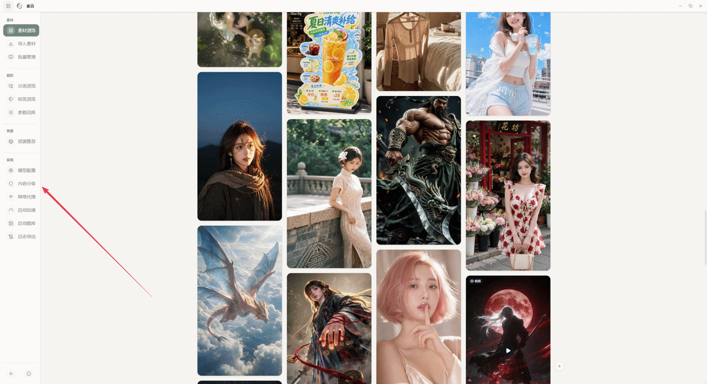

# 素言 SuYan

**本地 AI 提示词与图像素材管理工具**

帮你把效果图和提示词收在一起，随时找、随时改、随时带走

[GitHub](https://github.com/guliacer/SuYan) · [核心亮点](#-核心亮点) · [功能全景](#-功能全景) · [快速开始](#-快速开始) · [常见问题](#-常见问题) · [收费公示](#-收费公示)

**永久免费 · 开源分享 · 遇收费请 [举报](https://github.com/guliacer/SuYan/issues)**

 

<strong>主界面大概长这样：</strong>左边切换素材库、导入、词库和设置；中间是瀑布流卡片，每张卡片绑着效果图和提示词摘要。
可以调列数、搜标题或提示词、按分类 / 标签 / 精选筛选，也能按时间、尺寸或随机排序。
点进卡片就能编辑、复制或分享。

> 💚 **素言始终免费，欢迎放心使用。**  
> 项目基于 MIT 协议开源，软件本身不收费，也没有付费激活或会员。  
> 如果网上有人在卖安装包、收「安装服务费」等——**请直接举报**，不要付款，优先从 [GitHub](https://github.com/guliacer/SuYan) 下载。  
> 也欢迎把链接、截图或店铺信息 [发给我们](https://github.com/guliacer/SuYan/issues)：核实后会在下方 [收费公示](#-收费公示) 中列出，避免更多人上当。

---

## ✨ 核心亮点

> **素言** 把效果图、正 / 负向提示词、分类标签和可替换词条放进同一套本地库，灵感能搜到、能复用、也能一键带走。

- 🗂️ **本地优先** — 素材和提示词都在本机，打开就能用，不依赖云同步
- 🖼️ **图文一体** — 效果图和提示词绑在一起看，浏览、编辑、复制、分享顺手
- ✨ **AI 可选** — 拆参数、扩词条、反推、翻译、优化，需要时再上；不配也能用
- 🧹 **好整理** — 压缩、去重、批量导入导出，库大了也不慌

---

## 🚀 功能全景

按日常使用顺序浏览即可。每个模块先看能力说明，再对照演示动图。

### 🏠 素材浏览

- **瀑布流画廊** — 卡片浏览图片 / 视频提示词，列数可调
- **全文搜索** — 按标题、文件名、提示词或标签找
- **筛选与排序** — 按分类、标签、精选筛；按导入 / 修改时间、尺寸或随机排
- **精选收藏** — 一键标心，单独看喜欢的那批

---

### 📥 导入素材

- **导入图片** — 本机批量选图入库
- **粘贴导入** — 剪切板图片直接贴进来
- **导入文档** — 识别 Word 里的图和对应提示词
- **导入分享** — 导入别人的 ZIP，或解析网络分享链接

#### 本地导入

左侧「导入素材」→「导入图片」，多选本机文件即可入库；也支持粘贴与 Word 图文。

#### 网络导入

粘贴分享链接后，软件会解析并下载远程图文到本地。若站点要代理，先到「网络代理」配好再试。

#### 分享包导入

详情页或「批量管理」可导出 ZIP（含图与提示词）；对方用「导入分享」一键入库，无需账号。

---

### 🗂️ 批量管理

- **统一列表** — 一眼看到各组数量和标签概况
- **批量导出 / 导入** — 勾选导出分享包，或批量导入整理
- **批量删除** — 多选一次清掉，删除前会再确认
- **图像压缩** — 批量压图，可原格式或 WebP，质量可调
- **视频压缩** — 批量压视频，可选目标分辨率
- **去重检测** — 扫重复图，留一份清掉多余

---

### 📝 提示词详情

- **图文对照** — 一边看效果图，一边改正 / 负向提示词
- **复制 / 分享** — 复制到剪切板，或导出分享包
- **分类与标签** — 手改，也能让 AI 给建议
- **模型标注** — 记下生成方式，以后好筛、好回想
- **多图管理** — 同一组可挂多张效果图，支持导入、标心、删除

在瀑布流点开任意卡片即可进入详情。

---

### ✨ AI 创作助手

- **参数分析** — 长提示词拆成可点胶囊，局部替换更轻松
- **AI 词条** — 按当前参数生成同类候选词
- **提示词优化** — 按规则整理结构，画面更好控
- **中英翻译** — 尽量保住参数结构做互译
- **图像反推** — 根据效果图反推完整提示词
- **规则预设** — 不同操作可配不同服务商 / 模型 / 规则，右键快切

> 先在「模型配置」里填好接口；不配 AI 也能正常本地浏览和编辑。

---

### 🎬 视频提示词

- **视频卡片** — 单独展示，带封面和时长
- **关键帧时间轴** — 一键出关键帧，方便看镜头节奏
- **参考素材** — 从文件、剪切板或链接导入参考图 / 音频

---

### 📚 词库组织

- **分类** — 分组、说明、配图
- **标签** — 统一命名，方便检索
- **参数词库** — 沉淀参数、变量和默认值，可导入导出

---

### 🌐 资源推荐

- **常用站点** — 汇总即梦、Civitai、LibLib 等入口
- **一键复制** — 复制链接，去浏览器继续逛

---

### ⚙️ 系统设置

- **模型配置** — 多个 AI 接口、模型与 Key；分析 / 反推 / 翻译可各定规则
- **内容分级** — 自动 NSFW、默认模糊、批量校正、速度可调
- **网络代理** — 系统代理 / 手动 / 直连，支持自动检测
- **启动加速** — 按硬件选硬件加速，重启后生效
- **启动图库** — 自定义启动轮播图
- **外观** — 浅色 / 深色一键切换

#### 模型配置

Key 只存在本机并加密保存，不会打进安装包或仓库。

#### NSFW 内容分级

开启后瀑布流默认模糊敏感图，详情可临时看清，也支持批量重校。

#### 启动图库

安装包默认带 6 张启动图，可换成自己的作品，下次启动生效。

---

## 📥 快速开始

### 系统要求

| 项目 | 要求 |
|------|------|
| 操作系统 | Windows 10 / 11（64 位） |
| 磁盘空间 | 按你的图片 / 视频量预留即可 |
| 网络 | 可选；用 AI、解析分享链接时才需要 |

### 安装步骤

1. **下载** 最新安装包 `素言-Setup-0.1.0.exe`，或直接用便携版里的 `素言.exe`  
   （软件本身免费；建议从 [GitHub Releases](https://github.com/guliacer/SuYan) 获取。若别处收费，请 [举报](https://github.com/guliacer/SuYan/issues)，也可发给我们，核实后会在项目中公示）
2. **安装或打开** 按向导安装，或直接跑便携版
3. **导入素材** 左侧「导入素材」：图片、粘贴、文档或分享包都行  
   （可对照上方 [本地导入](#本地导入) / [网络导入](#网络导入)）
4. **开始整理** 瀑布流里浏览，点进详情改提示词；要用 AI 时再配接口  
   （可对照 [AI 创作助手](#-ai-创作助手) / [模型配置](#模型配置)）

---

## ❓ 常见问题

<b>素言收费吗？网上有人卖安装包怎么办？</b>

**A：** 不收费。基于 MIT 开源，软件本身始终免费，没有付费激活或会员。  
若有人卖包、要付费解锁或收「安装服务费」，**请直接举报**，不要付款；优先从 [GitHub Releases](https://github.com/guliacer/SuYan) 下载。  
也欢迎把链接、截图或店铺信息发到 [Issues](https://github.com/guliacer/SuYan/issues)。核实后我们会记入 [收费公示](#-收费公示)，避免更多人上当。

<b>素材存在哪？会不会上传到网上？</b>

**A：** 默认都在你本机。日常浏览和编辑不用联网。只有你主动用远程 AI、解析网络分享或下载远程图时，才会发网络请求。

<b>怎么配置 AI？</b>

**A：** 打开左侧「模型配置」，填接口地址、模型和 API Key 后保存。详情页里右键 AI 相关按钮，还能给不同操作换服务商、模型和规则。详见上方 [模型配置](#模型配置)。

<b>分享链接解析失败怎么办？</b>

**A：** 先确认网络正常。若站点要代理，到「网络代理」里开启或填写代理，也可以试一下「自动检测」。

<b>怎么把素材分享给别人？</b>

**A：** 详情页点「分享」，或在「批量管理」里导出选中的组，把生成的分享包发给对方导入即可。详见上方 [分享包导入](#分享包导入)。

<b>NSFW 图片怎么处理？</b>

**A：** 在「内容分级」里打开自动分级和默认模糊。详情里可临时显示或再模糊，也可以批量重校。详见上方 [NSFW 内容分级](#nsfw-内容分级)。

<b>视频相关功能不可用？</b>

**A：** 视频卡片、关键帧和视频压缩依赖视频相关能力。请确认已启用；若仍不行，可重装或更新后再试。

---

## 🚨 收费公示

素言**永久免费**。下列渠道经用户反馈并核实后公示，**请勿在此购买或下载**，以免财产损失或安装到被篡改的版本。

### 如何举报

1. 打开 [GitHub Issues](https://github.com/guliacer/SuYan/issues) 新建反馈
2. 尽量附上：**链接 / 店铺名 / 截图 / 大致收费方式**（售卖安装包、付费激活、「安装服务费」等）
3. 核实后会更新本页名单；情况紧急也可直接在 Issue 里 @ 维护者

> 官方下载请只用 [GitHub Releases](https://github.com/guliacer/SuYan/releases)。未列入名单不代表安全，陌生付费渠道一律不建议。

### 已核实名单

| 渠道 / 店铺 | 大致行为 | 反馈时间 | 备注 |
|-------------|----------|----------|------|
| （暂无） | — | — | 收到并核实后会更新到这里 |

<!--
填写示例（核实后取消注释并改成真实信息）：
| 某网盘分享页 / 某店铺名 | 售卖安装包 / 收取安装服务费 | 2026-07 | 非官方 |
-->

---

## 🤝 参与贡献

欢迎提功能建议、体验反馈和问题报告。

提需求时尽量写清：

1. 你想完成的操作
2. 现在遇到的情况，或期望的结果
3. 能复现的步骤（如果有）

---

## 免责声明

本项目基于 [MIT License](./LICENSE) 开源，**永久免费**，仅供学习与个人创作整理使用。请遵守相关法律法规，合理使用 AI 生成内容；使用过程中的风险由使用者自行承担。

如果这个项目对你有帮助，欢迎点一颗 ⭐，或转给同样需要管理提示词的朋友。

### Buy me a coffee ~

软件本身不收费。若愿意请作者喝杯咖啡，可扫下方收款码（完全自愿，不影响任何功能）：

<table>
  <tr>
    <td align="center" width="280">
      
       
      微信
    </td>
    <td width="48"></td>
    <td align="center" width="280">
      
       
      支付宝
    </td>
  </tr>
</table>

---

**Made with ❤️ by 素言 SuYan**

