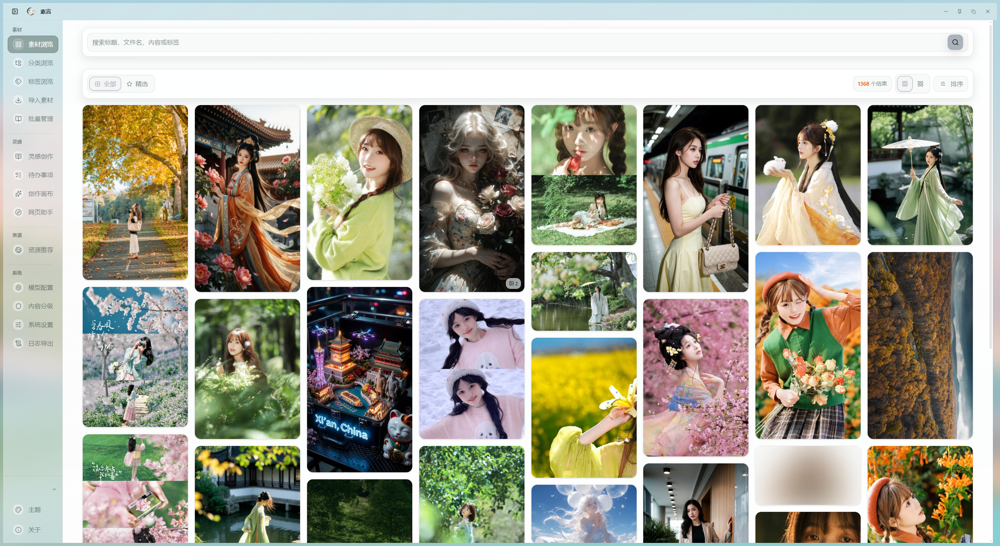
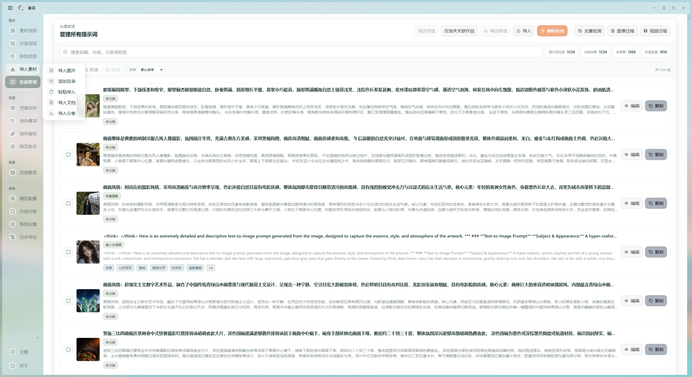
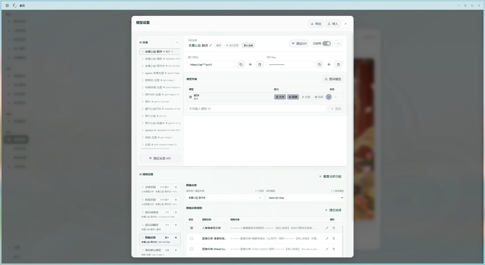
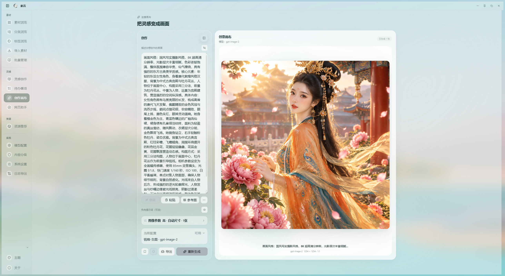
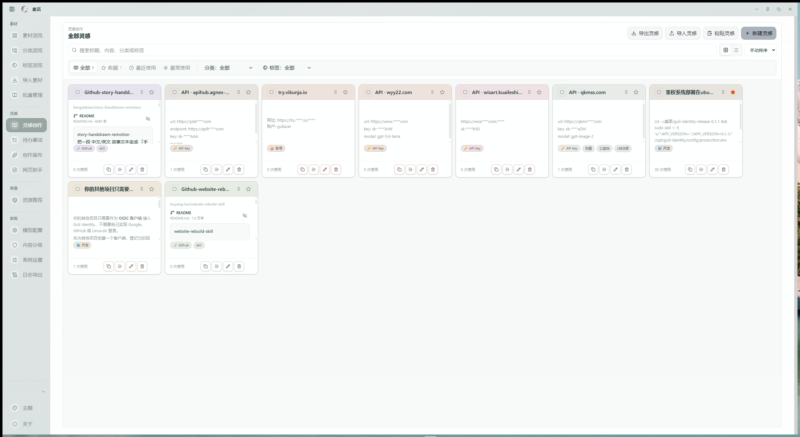
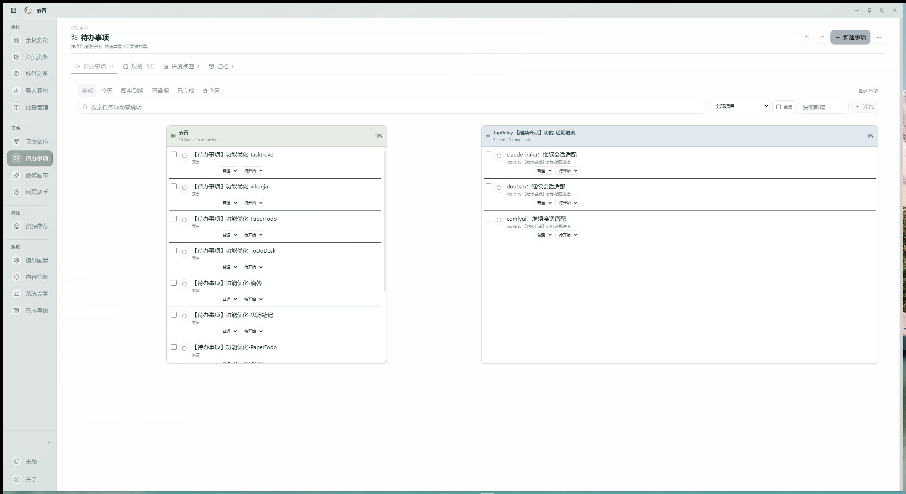
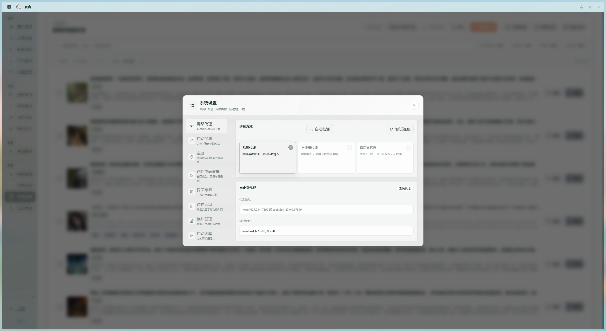

<div align="center">

# 素言 SuYan

**简体中文** | [English](./README.en.md)

**本地优先的 AI 提示词、图像与创作素材管理工具**

把效果图、视频、提示词、分类、标签和创作计划放在一起，方便查找、复用、整理与分享。

[GitHub](https://github.com/guliacer/SuYan) · [功能](#功能) · [快速开始](#快速开始) · [更新日志](#更新日志) · [常见问题](#常见问题)

**永久免费 · MIT 开源 · 软件本身不收费**

<br />



</div>

> 素言默认把素材、提示词、设置和日志保存在本机。账号登录用于身份确认、作品归属和账户验证导入，不等于云同步；登录前的本地作品也不会自动上传或认领。

## 功能

### 素材库

- 瀑布流浏览图片、视频和同组效果图，支持列数、网格 / 列表视图与响应式布局。
- 按标题、文件名、提示词、分类和标签搜索；按精选、时间、尺寸或随机方式筛选排序。
- 详情页支持编辑正向 / 负向提示词、复制文本、复制图像、收藏、分类、标签、模型信息和多张效果图。
- 保持同一提示词组的原始效果图在前，后续导入的效果图按加入时间追加。
- 缩略图缺失、生成中或生成失败时自动等待、回退到原图并显示明确状态。


### 导入、批量处理与导出

- 从本机批量导入图片 / 视频，直接粘贴剪贴板图像，导入 Word 图文，或导入分享 ZIP。
- 添加已有素材目录建立外链索引，不复制原文件；支持目录监视、重新定位、增量扫描和缺失索引清理。
- 解析受支持的网络分享链接；需要时可在系统设置中配置系统代理、自定义代理或直连。
- 批量管理支持选择、复制、删除、去重、图像压缩和视频压缩。
- 导出过程显示进度，任务在后台执行，不阻塞页面；导入 / 导出目录会记住上一次使用的位置。
- 提示词分享包可携带所选作品对应的分类库、标签库、分组和封面；导入后恢复已有整理结果。
- 导出文件名包含软件名、版本、内容类型和时间，便于区分不同批次。



### AI 创作助手

- 为分类识别、标签识别、提示词优化、翻译、图像反推和生图分别配置服务商、模型与规则。
- 从提示词或效果图分析分类与标签；模型列表优先使用接口实际返回的模型名称，并记住每个操作的默认模型和分析来源。
- 提示词分析会按主体、场景、构图、光影和风格等维度整理内容；AI 结果经过本地规则约束，避免把视觉属性误当分类，或生成缺乏依据的标签。
- 标签旁提供「归纳整理」，用于同义词统一、未分组标签归纳、实体分组和分组纠正；支持预览、确认和最近一次撤销。
- AI 设置支持普通导出、密码加密导出和按账户验证的加密导出。账户验证包只能由同一账户验证后导入。



> AI 接口和 API Key 由用户自行配置。未配置 AI 时，素材浏览、编辑、导入、导出和本地词库仍可使用。

### 创作画布

- 在软件内编辑提示词并调用已配置的图像 / 视频模型生成作品。
- 生成结果会自动适配可用画布空间，支持复制、收藏、导出、重新生成和加入本地素材库。
- 参数区可以收起并恢复；画布背景支持主题跟随、经典白色、自定义颜色和自定义图片。
- 生图时提供扫描、能量场、粒子和完成收束动效；平时保持克制的静态展示。
- 支持参考图、剪贴板粘贴、快捷模型切换和生成错误的结构化提示。



### 灵感库与待办

- 独立保存没有效果图的文字提示词、工作流、配置笔记和 GitHub 项目说明。
- 支持富文本、变量、分类、标签、收藏、拖拽排序、复制、导入和导出。
- 待办支持项目、子任务、优先级、进度、标签、归档和快速添加。
- 月历支持单休、大小周、双休等工作模式；工作日、休息日和调休可手动调整，并可联网查询节假日数据。
- 待办支持按全部或选中任务导入 / 导出。





### 账户与作品归属

- 通过 [Guli Identity](https://auth.guliacer.dpdns.org) 使用 OIDC Authorization Code + PKCE 真实授权。
- 邮箱注册 / 登录、Google、GitHub、Linux.do 和设备验证码流程均在系统默认浏览器中完成；素言不接触第三方密码或 `client_secret`。
- 支持关联多种登录方式；授权后由用户确认是否使用当前账户或新账户的昵称、头像，也可自定义资料。
- 登录后新生成的作品可记录账户资料；登录前的旧作品不会自动同步。用户可在详情页或批量管理中确认同步，覆盖已有作者信息时会二次提醒。
- 更换账户头像后，本机关联作品按新头像更新；分享包可以保留作者资料。
- 账户令牌由 Electron 主进程使用系统安全存储保护，账户数据不会写入 README、安装包或 Git 仓库。

### ComfyUI、网页助手与资源推荐

- 本机收件服务监听 `127.0.0.1:9477`，可接收 ComfyUI 发来的图片、提示词、负向提示词、标题和生成方式。
- 自动解析 PNG 中的 ComfyUI prompt / workflow 元数据，并复用图片导入链路落盘到本地素材库。
- 网页助手提供受控的网页工作区和站点目录，可在软件内辅助使用常见创作网站。
- 资源推荐集中展示仍在维护的模型、工具、提示词和创作资源入口；失效推荐会移除或更新。

### 内容分级与可选组件

- 支持本地 NSFW 内容分级、默认模糊、详情临时查看和批量重新检测。
- FFmpeg 与本地 NSFW 识别运行库作为可选组件按需安装，组件下载地址固定、清单签名和文件哈希校验通过后才会安装。
- 无需视频处理或本地分级时，不必安装对应组件；正式包不会把个人素材、账号、设置或日志打进去。

### 外观、语言与辅助体验

- 标题栏和侧边栏使用半透明毛玻璃材质；主题支持主色、次要色、第三色、导航区、背景层和工作区分别调整。
- 创作页面背景可独立设置，并随主题颜色变化；布局、边栏入口和置顶状态会记忆到本地。
- 默认使用简体中文，可在系统设置切换 English；用户自己的提示词、标签、分类和素材内容不会被自动翻译。
- 首次进入各个功能页提供可跳过、可重新打开的精确引导，覆盖导入方式、提示词卡片、画布参数、AI 连接、系统设置和窗口控制。
- 应用支持检查 GitHub 正式版本；用户可以选择升级、下次提醒、忽略当前版本或永久不提示。



## 快速开始

### 使用发布包

从 [GitHub Releases](https://github.com/guliacer/SuYan/releases) 下载当前可用版本的安装包或便携版。当前正式版为 `v0.3.6`，GitHub 上的最新版本以 Releases 页面为准。

如果 GitHub 下载较慢，也可以使用网盘镜像：

- [夸克网盘](https://pan.quark.cn/s/5d22e38ac71a)
- [百度网盘](https://pan.baidu.com/s/1clGqo2sebMwzt3WhwESWQA)，提取码：`bf8y`

网盘中的文件请按文件名选择对应的安装版或便携版，并在下载后使用随附的 `SHA256SUMS.txt` 校验文件完整性。

安装版按向导选择目录后启动；便携版解压到可写目录后运行 `素言.exe`。首次启动会在软件目录创建 `data\` 和 `logs\`。

### 本地开发

环境要求：Windows 10 / 11、Node.js、pnpm 11.9.0。

```powershell
pnpm install
pnpm dev
```

常用检查命令：

```powershell
pnpm typecheck
pnpm test
pnpm check:secrets
pnpm check:empty-shell
pnpm check:release-notes
```

开发阶段快速生成 Windows 便携目录：

```powershell
pnpm package:win
```

准备正式发布包时使用：

```powershell
pnpm package:win:release
```

发布包不应包含 `data\`、`logs\`、API Key、账户凭据、个人素材或私密配置。四版本组件包的构建方式见 [docs/Windows四版本打包.md](./docs/Windows四版本打包.md)。

推送或创建 GitHub Release 前，必须通过 `pnpm check:release-notes`；对应 Release 已存在时，再运行 `pnpm check:release-notes:remote`，确认中文 / English 描述与远程正文一致。

### Guli Identity 配置

正式安装包只需要公共 OIDC 客户端信息，不需要 `client_secret`。开发或打包前配置被 Git 忽略的 `private/guli-identity.env`，或使用 `config/guli-identity.public.env`：

```env
GULI_IDENTITY_ISSUER=https://auth.guliacer.dpdns.org
GULI_IDENTITY_CLIENT_ID=你的公共客户端ID
GULI_IDENTITY_REDIRECT_URI=suyan://oauth/callback
GULI_IDENTITY_SCOPES=openid email profile offline_access
```

服务端需要登记回调地址 `suyan://oauth/callback`。生产环境的 Discovery、授权、令牌、用户信息和 JWKS 地址必须使用 HTTPS。

## 数据与隐私

- 托管素材位于软件目录的 `data\library\`，日志位于 `logs\`；外链素材只保存已登记目录的相对索引，不复制或删除原文件。
- API Key 和账户令牌不会写入 README、安装包或日志；日志会自动脱敏，不记录完整提示词、图片二进制或个人凭据。
- 素材库、灵感库、待办、词库和设置默认只保存在本机。登录不提供云同步，也不会自动上传登录前的作品。
- 安装版覆盖升级和卸载可能删除软件目录下的 `data\`；升级前请退出软件，把整个 `data\` 文件夹复制到软件目录之外备份。分享 ZIP 只用于交换选中的作品，不等同于完整备份。

## 更新日志

### v0.3.6（当前正式版）

本版本相较于 GitHub 最新正式版 `v0.2.10`，集中完善了账号、创作、归档和交付链路：

**新增**

- Guli Identity 真实浏览器授权、邮箱注册、Google / GitHub / Linux.do、设备验证码和多方式关联。
- 账户昵称、头像确认与自定义；作品归属、批量同步和账户验证导出。
- 灵感库、待办月历、工作模式、节假日查询与待办导入导出。
- ComfyUI 本机收件服务、网页助手、本地 NSFW 分级和可选组件安装。
- AI 设置的普通、密码加密和账户验证导出 / 导入。
- 中文 / English 界面切换、版本检查通知和完整的页面功能引导。

**优化**

- 创作画布自适应展示、主题跟随背景、参数侧栏和生图动效。
- 模型列表改为接口实际模型名称，并记忆各操作的默认模型与分析来源。
- 分类 / 标签归纳整理、同义词合并、实体分组和错误分组约束。
- 图片复制、缩略图回退、原图顺序、导出进度、后台导出和目录记忆。
- 毛玻璃导航、多角色主题色、响应式布局、统一弹窗与安装 / 卸载界面。
- 日志脱敏、错误提示、数据目录保护和正式包安全检查。

### v0.2.10

- 新增已有素材目录直挂、内置画布、可配置分析来源、提示词网站适配和资源推荐。
- 优化分享、数据存放、菜单布局、拖入归纳、弹窗、分类 / 标签分析、AI 错误提示和页面布局。

## 常见问题

<details>
<summary><b>素言收费吗？</b></summary>

不收费。项目使用 MIT 协议开源，没有会员、付费激活或付费安装服务。请从 [GitHub Releases](https://github.com/guliacer/SuYan/releases) 下载；遇到收费安装包可在 [Issues](https://github.com/guliacer/SuYan/issues) 举报。

</details>

<details>
<summary><b>不配置 AI 能不能使用？</b></summary>

可以。素材浏览、搜索、编辑、复制、收藏、导入导出、词库和待办均可本地使用。只有 AI 分析、在线生图、网络解析和部分网页功能需要网络或接口配置。

</details>

<details>
<summary><b>登录后会自动同步旧作品吗？</b></summary>

不会。登录前的本地作品保持原样；登录后新生成或新导入的作品可按用户确认关联到账户。详情页和批量管理提供手动同步入口，覆盖已有作者信息前会再次确认。

</details>

<details>
<summary><b>为什么第三方登录要打开浏览器？</b></summary>

这是实际的 OIDC 浏览器授权流程。素言只发起 PKCE 授权请求，不在应用内收集 Google、GitHub 或 Linux.do 密码；授权完成后通过 `suyan://oauth/callback` 回到软件。

</details>

<details>
<summary><b>升级前如何备份？</b></summary>

退出软件后复制软件目录下的整个 `data\` 文件夹。分享包只包含选中的作品和相关知识，不能替代完整数据备份。

</details>

<details>
<summary><b>遇到问题如何反馈？</b></summary>

先在软件的「日志导出」中导出诊断日志，再到 [GitHub Issues](https://github.com/guliacer/SuYan/issues) 描述复现步骤、预期结果和实际结果。日志会脱敏，但仍建议反馈前检查附件内容。

</details>

## 贡献与许可

欢迎提交问题、功能建议和改进。请尽量说明复现步骤、运行版本、操作系统和预期结果。

本项目基于 [MIT License](./LICENSE) 发布。软件依赖 Electron、React、Vite、TypeScript、Zustand、Lucide、JSZip、Sharp、Chokidar、openid-client、Vitest 和 electron-builder 等开源项目；具体版本与许可证以 [package.json](./package.json) 和 [pnpm-lock.yaml](./pnpm-lock.yaml) 为准。

<div align="center">

**Made with ❤️ by SuYan 素言**

</div>
